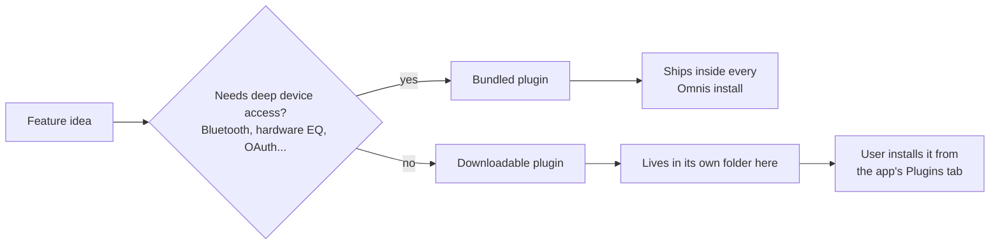

# Omnis-Plugins

[](LICENSE)
[](https://mrivoe.github.io/Omnis-Plugins/)
[](https://mrivoe.github.io/Omnis/)

## What is this?

This is where [Omnis](https://github.com/MrIvoe/Omnis)'s features live.
Omnis itself is just a small, stable player — everything it can *do*
(equalizer, lyrics, Spotify, YouTube, and more) is a plugin from this
repo.

## Who it's for

- **Omnis users** picking which features to install and which to skip.
- **Plugin authors** adding a new feature to Omnis, or publishing their
  own plugin for others to install.

## How it works

Two kinds of plugin, depending on how much access a feature needs:



- **Bundled** plugins ship inside the app itself — every Omnis install
  has them.
- **Downloadable** plugins are optional: a user installs only the ones
  they want, straight from the app, by picking one from the catalog or
  pasting a link.

## Why built this way

So a feature going wrong can never take the whole player down, and so
nobody is stuck with features they don't want. A crash in one plugin
stays contained to that plugin — playback keeps going either way.

## Where things live

```text
sample_logger/   an example downloadable plugin — copy it to start your own
lib/             bundled plugins (ship inside the app)
docs/            technical documentation — start here to build something
test/            automated tests
```

Full technical details — the exact yaml format, the plugin API, every
bundled plugin's permissions — are in **[docs/README.md](docs/README.md)**.

## Contributing

See [CONTRIBUTING.md](CONTRIBUTING.md) for the workflow, and
[docs/README.md](docs/README.md) for the technical rules.

## License

[MIT](LICENSE).
